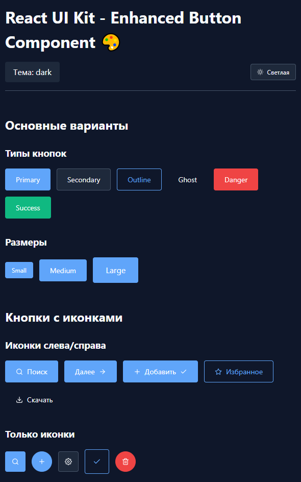

# React UI Kit

Современная библиотека компонентов пользовательского интерфейса React со встроенной поддержкой светлых / темных тем.

## Кнопка (✅Готово)

 - Варианты: primary, secondary, outline, ghost, danger, success
 - Размеры: small, medium, large
 - Иконки (react-icons)
 - Состояния: loading, disabled
 - Дополнительно: rounded, fullWidth, ссылки




## 🚀 Особенности

- 🎨 **Светлые и темные темы ** с автоматическими переменными CSS
- 🎯 **Типобезопасные компоненты ** с PropTypes
- 🎨 **SCSS-модули ** для стилизации в определенных областях
- ⚡ **Vite** для быстрой разработки
- ♿ **Специальные возможности ** сфокусированные
- 🎨 ** Пользовательские свойства CSS ** для создания тем

## 📦 Installation (клонирование и установка)

```bash
# Clone the repository
git clone https://github.com/your-username/react-ui-kit.git
cd react-ui-kit

# Install dependencies
npm install

# Start development server
npm run dev 
```