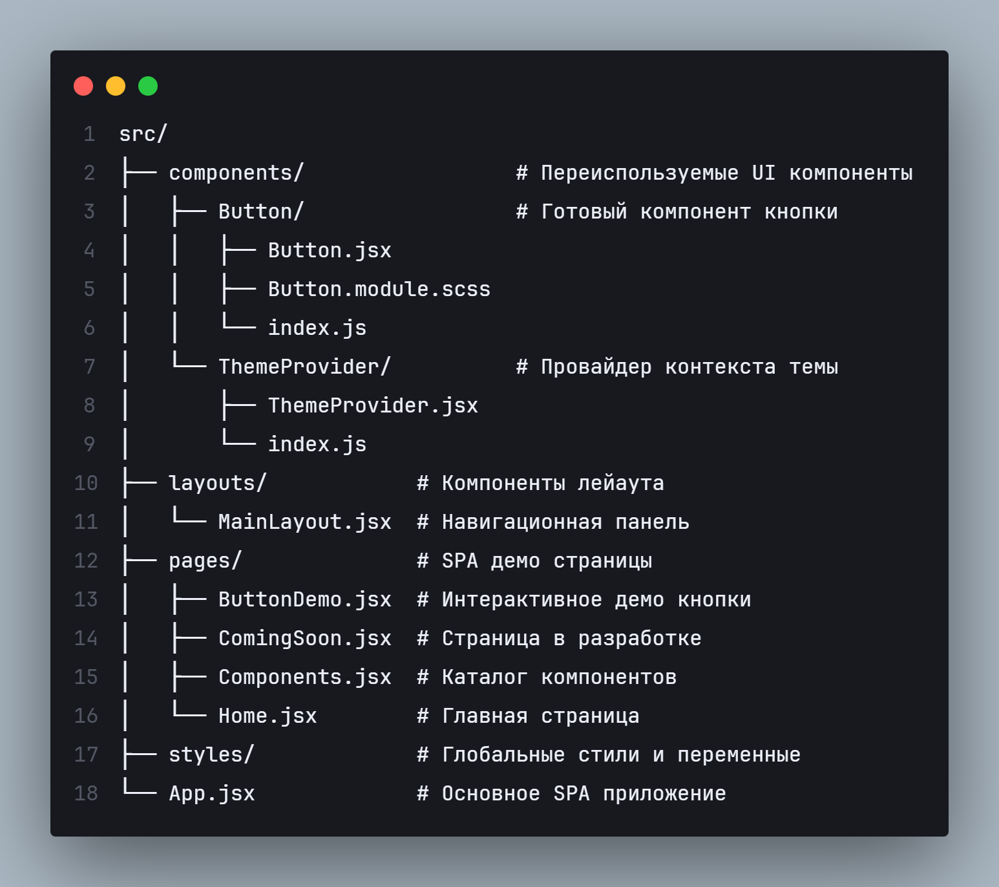

# React UI Kit 🎨

[](https://reactjs.org/)
[](https://vitejs.dev/)
[](https://sass-lang.com/)
[](https://opensource.org/licenses/MIT)

**Современная библиотека React компонентов с профессиональным SPA демо** - Демонстрация навыков frontend-разработки и готовых к продакшену компонентов.

## 🎯 Обзор проекта

Этот проект представляет собой:
1. **Профессиональное SPA демо** - Интерактивная демонстрация компонентов
2. **Готовую к продакшену UI библиотеку** - Переиспользуемые React компоненты
3. **Портфолио навыков** - Демонстрация современных навыков фронтенд-разработки

## ✨ Особенности

### 🎨 Профессиональное SPA демо
- **Интерактивная площадка компонентов** - Тестирование компонентов в реальном времени
- **SPA навигация** - React Router с интуитивной боковой панелью
- **Переключение тем на лету** - Мгновенное переключение light/dark режимов
- **Адаптивный дизайн** - Mobile-first подход

### 🛠️ Готовые к продакшену компоненты
- **✅ Компонент Button** - Полный набор вариантов, размеров, иконок, состояний
- **🎯 Поддержка TypeScript** - Полная типобезопасность
- **🎨 SCSS Modules** - Изолированные, поддерживаемые стили
- **🌓 CSS Custom Properties** - Простая система тем
- **♿ Доступность** - ARIA метки, клавиатурная навигация
- **📱 Responsive** - Работает на всех устройствах

### 🚀 Современный стек технологий
```
Frontend:    React 18, React Router DOM, React Icons
Инструмент сборки: Vite (сверхбыстрая разработка)
Стилизация:  SCSS Modules, CSS Custom Properties
Архитектура: Компонентная, модульный CSS
Качество:    TypeScript, PropTypes, готовность ESLint
```

## 📋 Статус компонентов

| Компонент | Статус | Описание |
|-----------|--------|-------------|
| **Button** | ✅ Готов | Полнофункциональная кнопка с 6 вариантами |
| **Input** | 🔄 В разработке | Поля ввода с валидацией |
| **Checkbox** | 📅 Запланировано | Кастомный чекбокс |
| **Select** | 📅 Запланировано | Выпадающий список |
| **Modal** | 📅 Запланировано | Диалоговые и модальные окна |
| **Table** | 📅 Запланировано | Таблицы данных с сортировкой |

*Полная дорожная карта в [ROADMAP.md](./ROADMAP.md)*

## 🚀 Быстрый старт

### 1. Установка
```bash
# Клонировать репозиторий
git clone https://github.com/your-username/react-ui-kit.git
cd react-ui-kit

# Установить зависимости
npm install

# Запустить сервер разработки
npm run dev
```

### 2. Использование компонентов
```jsx
import { Button } from './components';
import { FiSearch } from 'react-icons/fi';

function App() {
  return (
    <Button 
      variant="primary"
      size="medium"
      startIcon={<FiSearch />}
      onClick={() => console.log('Нажато')}
    >
      Поиск
    </Button>
  );
}
```

## 🎨 Система тем

Библиотека использует CSS Custom Properties для простой настройки тем:

```css
/* Настройка переменных темы */
:root[data-theme="light"] {
  --color-primary: #3b82f6;
  --color-bg-primary: #ffffff;
  --color-text-primary: #1e293b;
}

:root[data-theme="dark"] {
  --color-primary: #60a5fa;
  --color-bg-primary: #0f172a;
  --color-text-primary: #f8fafc;
}
```

## 📁 Структура проекта (со временем она будет больше)



## 🎯 Для работодателей и компаний

### Почему этот проект выделяется

#### 🏆 Продемонстрированные профессиональные навыки:
1. **Современный React** - Хуки, Context, дизайн компонентов
2. **Мастерство TypeScript** - Полная реализация типобезопасности
3. **Продвинутая стилизация** - SCSS Modules, паттерны CSS-in-JS
4. **SPA архитектура** - React Router, управление состоянием
5. **Оптимизация сборки** - Конфигурация Vite, tree-shaking
6. **Принципы UI/UX** - Доступность, адаптивный дизайн
7. **Git workflow** - Чистая история коммитов, стратегия ветвления

#### 💼 Бизнес-ценность:
- **Готово к продакшену** - Компоненты протестированы и задокументированы
- **Лицензия MIT** - Бесплатное использование в коммерческих проектах
- **Легкая кастомизация** - Система тем через CSS переменные
- **Производительность** - Оптимизированный размер бандла, быстрая загрузка
- **Поддерживаемость** - Чистый код, комплексная документация

### Варианты использования для компаний:
1. **Внутренние инструменты** - Готовые к использованию UI компоненты
2. **Прототипирование** - Быстрая разработка UI
3. **Учебный ресурс** - Современные паттерны React
4. **Основа дизайн-системы** - Расширяемая библиотека компонентов

## 🔧 Разработка

### Доступные скрипты
```bash
# Разработка
npm run dev          # Запуск сервера разработки

# Сборка
npm run build        # Сборка для продакшена
npm run preview      # Предпросмотр продакшен сборки

# Качество кода
npm run lint         # Запуск ESLint
npm run type-check   # Проверка типов TypeScript
```

### Git workflow
Этот проект демонстрирует профессиональные практики Git:
- ✅ Семантические сообщения коммитов
- ✅ Функциональное ветвление
- ✅ Чистая история коммитов
- ✅ Структура кода готовая к PR

## 📈 Дорожная карта

### Краткосрочная (следующие 2 недели)
1. Завершить компонент Input с валидацией
2. Добавить компоненты Checkbox и Radio
3. Реализовать компонент Modal
4. Улучшить документацию с Storybook

### Среднесрочная (следующий месяц)
1. Добавить сложные компоненты (Table, Select, DatePicker)
2. Реализовать утилитарные компоненты (Toast, Tooltip, Spinner)
3. Создать комплексный набор тестов
4. Опубликовать в npm package registry

### Долгосрочная
1. Расширить библиотеку компонентов (30+ компонентов)
2. Добавить продвинутую систему тем
3. Создать документацию дизайн-системы
4. Контрибуции сообщества и поддержка

## 👥 Участие в разработке

Участие приветствуется! Этот проект идеален для:

1. **Junior разработчиков** - Изучение современных паттернов React
2. **Опытных разработчиков** - Обмен экспертизой и лучшими практиками
3. **Дизайнеров** - Улучшение UI/UX и доступности
4. **Компаний** - Спонсирование разработки необходимых компонентов

См. [CONTRIBUTING.md](./CONTRIBUTING.md) для руководства.

## 📄 Лицензия

Этот проект лицензирован под **MIT License** - смотрите файл [LICENSE](./LICENSE) для деталей.

### Коммерческое использование
- ✅ Бесплатно для личного и коммерческого использования
- ✅ Атрибуция не требуется (но приветствуется!)
- ✅ Свободно модифицировать и распространять
- ✅ Использовать как шаблон для ваших проектов


## 📞 Контакты и поддержка

**Мейнтейнер проекта**:  LMS AIC
**Email**: lumaksaic@gmail.com  
**Telegram**: https://t.me/lumaks_aic

---

<div align="center">

### ⭐ Если проект оказался полезным, поставьте звезду!

[](https://github.com/lms-42-R/react-ui-kit)
**Создано с ❤️ [LMS-42R](https://github.com/lms-42-R)**

</div>

## 🔗 Ссылки

- **GitHub репозиторий**: [github.com/lms-42-R/react-ui-kit](https://github.com/lms-42-R/react-ui-kit)
- **npm пакет**: [Скоро](#)

---

*Этот README является частью профессиональной презентации. Фактическая реализация демонстрирует все описанные особенности.*